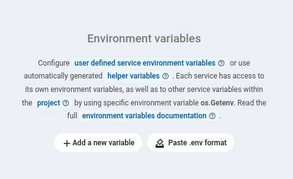

## Building a simple TODO app with gin-gonic in Zerops

Building APIs is bread and butter for most programmers. Zerops makes this process as easy as pie by taking care of the infrastructure.

In this article we will show you how simple it is to build a sample TODO API written in GO using *gin-gonic* - one of the most popular web frameworks.

Resulting project is available [here](https://github.com/zeropsio/recipe-gin-postgres-api).

### 1. Requirements

* [Go](https://www.golang.org) (tested on 1.18)
* [PostgreSQL 12](https://www.postgresql.org)

Both of these requirements can be fulfilled using Zerops managed services.

### 2. Getting started

First and foremost we need a database system to store and manage our data. In this case we chose **PostgreSQL**.

> In case you prefer other technologies, such as **MariaDB**, which is also supported by Zerops, the process is analogical and source code can be found [here](https://github.com/zeropsio/recipe-gin-mariadb-api).

Let's start with running a PostgreSQL server. We can create one in
Zerops. More information about PostgreSQL in Zerops can be found [here](https://docs.contabozerops.com/documentation/services/databases/postgresql.html#adding-the-postgresql-service-in-zerops).<!-- TODO: WIKI / print screen -->

All it takes is to create a new project, and add a PostgreSQL service.
For the purpose of this sample API, we kept all default settings but hostname - we named the service **db** (keep this in mind, we will be using the hostname later).

To test the connection or for local development we can connect to the server with Zerops own zCLI - it can be easily [installed](https://docs.contabozerops.com/documentation/cli/installation.html#how-to-install) either by using *npm* or by downloading the latest version from Github releases. 
After you have installed zCLI, follow [these simple steps](https://docs.contabozerops.com/documentation/cli/authorization.html#login-using-personal-token) to log in using a personal access token.
Last step is to start a vpn connection by running 
```sh
$ zcli vpn start [projectName]
```

Now we should be able to test that the server is accessible by running 
```sh
$ ping6 [hostname].zerops` # in our case db.zerops
```

### 3. Golang
#### Dependencies

We will create the API as a GO module for easier versioning and reproducibility of builds.
New GO modules are created with:

```sh
$ go mod init [api-name]
```

This command creates two files, `go.mod` and `go.sum`, that contain dependency information.

Following GO packages are used in the example:

* [github.com/georgysavva/scany *(v1.1.0)*](https://github.com/georgysavva/scany) 
* [github.com/gin-contrib/cors *(v1.4.0)*](https://github.com/gin-contrib/cors)
* [github.com/gin-gonic/gin *(v1.8.1)*](https://github.com/gin-gonic/gin)
* [github.com/jackc/pgx/v4 *(v4.17.1)*](https://github.com/jackc/pgx/v4)

and they can be installed using

```sh
$ go get [package-url]
```

More information on how to use *go modules* can be found [here](https://go.dev/blog/using-go-modules).

#### Folder structure
This being a sample application means that the project structure is very simple. 

```
todo-api/
├── http.go
├── main.go
├── model.go
├── go.mod
├── go.sum
├── schema.sql
└── zerops.yml
```

Source code of the api is contained in files

* `http.go` - regarding the http server
* `model.go` - for communication with the DB
* `main.go` - initialization and wiring of dependencies together

This is the boostrap of the Gin framework that is enought for it to run in zerops.
The following is our implementation of http server.

First of all we need to initialize the server by calling 
```go
r := gin.Default()
```

To run the http server smoothly not only in Zerops, we use several middlewares. 
That includes CORS support, better error logging that logs to Zerops runtime log, 
and `content-type` header addition, which is an example of custom written middleware. 

```go
r.Use(cors.Default())
r.Use(func(c *gin.Context) {
    c.Header("content-type", "application/json")
})
r.Use(gin.ErrorLoggerT(gin.ErrorTypePublic | gin.ErrorTypeBind))
r.RedirectTrailingSlash = true
```
Now that we are done with basic server setup, the only thing left is to register endpoints.
First we create a router group that will consist of routes with the same path prefix.
```go
g := r.Group("todos")
```
This api contains CRUD operations for working with the `todo` resource. We register `uri` path to
a handler, which processes the http request.
```go
g.GET("", handler.getTodos)
g.GET("/:id", handler.getTodo)
g.POST("", handler.createTodo)
g.PATCH("/:id", handler.editTodo)
g.DELETE("/:id", handler.deleteTodo)
```

We have chosen `createTodo` handler as an example in this blog post. For the rest of the handlers, 
consult the repository.

```go
func (t todoHandler) createTodo(c *gin.Context) {
	var todo Todo
	err := c.Bind(&todo)
	if err != nil {
		return
	}
	todo, err = t.model.Create(c.Request.Context(), todo)
	if err != nil {
		_ = c.AbortWithError(500, err)
		return
	}
	c.JSON(http.StatusOK, todo)
}
```

Finally, we can run this server on the port `3000` using the following code.

```go
log.Fatal(r.Run(":3000"))
```

### 4. Running the API locally

In the `main.go` file there are 3 *environment variables* used to connect and migrate the database.
We can do that by creating `.env` file with following content:
```env
ZEROPS_RECIPE_DATA_SEED=["foo", "bar"]
ZEROPS_RECIPE_DROP_TABLE=1
DB_URL=postgres://${user}:${password}@${hostname}:5432/${hostname}
```

To get values of `user`, `password` and `hostname` see [environment variables](https://docs.contabozerops.com/documentation/environment-variables/overview.html#referencing-environment-variables) in Zerops GUI. 

Make sure you have zcli vpn up and running to proceed here. The process was described in section [2. Getting started](#2-getting-started). 

Run this command to set environment variables and run the API:

```sh
$ source .env && go run main.go http.go model.go
```

### 5. Running the API in Zerops

After we completed the development of the API, and tested its functionality locally, it's time to deploy it to Zerops. For that
we need to create a configuration file called `zerops.yml`, which contains steps to build and deploy our app.
For the GO language this file is rather simple and looks like this:

```yaml
api:
  build:
    base: [ go@1 ]
    build:
      - go build -o app main.go model.go http.go
    deploy: [ app ]
  run:
    start: ./app
```

The simplest way to deploy our API to Zerops is to integrate it as an external [Github](https://docs.contabozerops.com/documentation/github/github-integration.html) or [Gitlab](https://docs.contabozerops.com/documentation/gitlab/gitlab-integration.html) repository.
We need to create a [Golang](https://docs.contabozerops.com/documentation/services/runtimes/golang.html#adding-the-golang-service-in-zerops) service in Zerops, while tweaking the initial settings corresponding environment variables should be set.  



After the service is created we enable a subdomain. When we access it, we see a response with todo entries from the
`ZEROPS_RECIPE_DATA_SEED` variable.

And that's it!

### Conclusion
Hopefully you managed to work along this article to deploy the api to Zerops successfully.
For further questions visit our Discord channel.